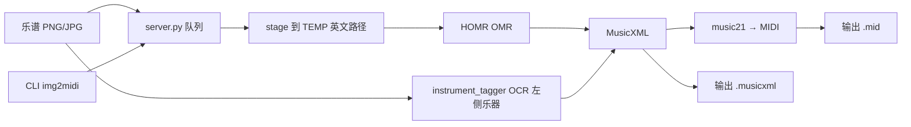

# 乐谱图片 → MIDI（Score2MIDI）

把**印刷体五线谱图片**识别成 **MusicXML + MIDI**，并自动标注谱面左侧的乐器名（GM 音色）。

> 状态：私有验证中。HOMR 引擎识别多声部总谱仍有上限，结果请对照原谱校对。

## 功能

- 拖拽 / 多选图片 → 排队识别 → 下载 `.mid` / `.musicxml`
- OCR 谱面左侧乐器名（Horn / Trumpet…），写入声部与 GM 音色
- 命令行批量转换
- 本地网页 GUI（仅 `127.0.0.1`，数据不出电脑）
- 中文路径兼容（OpenCV 限制已绕过）
- 支持断点续传下载 ONNX 模型

## 目录结构

```
.
├── README.md
├── THIRD_PARTY.md          # 上游项目与许可
├── requirements.txt
├── 启动可携带版.bat         # 双击：起服务 + 开浏览器
├── open_gui.ps1            # 等服务就绪后打开浏览器
├── server.py               # 本地 HTTP API + 队列
├── img2midi.py             # 命令行批量转换
├── instrument_tagger.py    # 左侧乐器 OCR → MusicXML/GM
├── download_models.py      # 下载/修复 ONNX 模型
├── web/                    # GUI（index.html / css / js）
├── docs/使用教程.md
├── 上传/ 输出/             # 运行时目录（gitignore）
└── homr_gui/               # 上游 HOMR 引擎（gitignore，见下文安装）
```

## 快速开始

### 1. 环境

- Windows 10/11
- Python 3.11–3.15（开发机为 3.14）
- 约 1.5 GB 磁盘（依赖 + 模型）

```bat
cd /d E:\乐谱转MIDI
python -m venv homr_gui\.venv
homr_gui\.venv\Scripts\python.exe -m pip install -r requirements.txt -i https://mirrors.aliyun.com/pypi/simple/
```

### 2. 引擎与模型

本仓不包含 `homr_gui/` 源码与权重。请克隆上游 GUI 封装（内含 `homr` 包）到 `homr_gui/`：

```bat
git clone --depth 1 https://github.com/Quackone/homr_gui.git homr_gui
```

或手动放置同名目录后：

```bat
homr_gui\.venv\Scripts\python.exe download_models.py
```

模型会下载到 `homr_gui/homr/**`（约 150MB，CPU 三件套）。

### 3. 启动

| 入口 | 说明 |
|------|------|
| `启动可携带版.bat` | 推荐：本地服务 + 打开 `http://127.0.0.1:8765` |
| `转换命令行.bat` | 批量：把图片/文件夹拖到 bat 上 |
| `homr_gui\.venv\Scripts\python.exe img2midi.py 图.png` | 命令行 |

### 4. 命令行示例

```bat
homr_gui\.venv\Scripts\python.exe img2midi.py 乐谱图片 --out-dir 输出
```

## 架构（简图）



## 已知限制

- 只认**印刷体西方五线谱**（简谱/手写不支持）
- 全乐队总谱可能只解出部分声部（建议按乐器裁切分转）
- 节奏、临时记号、多声部可能出错，**务必用 MuseScore 校对**
- PDF 需先转图片

## 二次开发

| 文件 | 职责 |
|------|------|
| `server.py` | 上传、队列、下载 API |
| `instrument_tagger.py` | 乐器 OCR 词典 + MusicXML 打补丁 |
| `web/app.js` | 前端拖拽与状态 |
| `download_models.py` | 镜像下载 / 断点续传 |

改动后建议用真实谱例跑一遍 `img2midi.py`。

## 许可

- 本仓库封装代码：建议 MIT（可按需修改 `LICENSE`）
- **HOMR / HOMR GUI 为 AGPL-3.0**，若分发衍生程序请遵守其条款，详见 [THIRD_PARTY.md](THIRD_PARTY.md)
